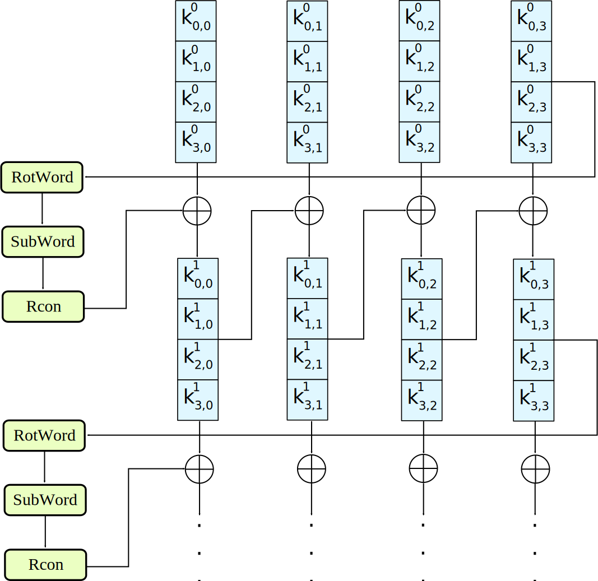

+++
title = "Matasano Cryptography Challenges: Basics"
date = 2022-11-14T19:54:00-06:00

[taxonomies]
tags = ["Programming", "Cryptography"]

[extra]
author = "Zane Fry"
+++

**What Should I Expect?**
> These are based off real-world vulnerabilities. None of them are "puzzles". They're not designed to trip you up. Some of the attacks are clever, though, and if you're not familiar with crypto cleverness... well, you should like solving puzzles.

<!-- more -->

This post contains full solutions to the problems in set 1. If these challenges are applicable to you, I encourage you to attempt them blind.
The progression and hints in these challenges are done very thoughtfully, so don't spoil the solutions if you want the full experience.

Full credit and my appreciation for the development of these problems goes to Matasano Security, the [Cryptography Services Team](https://cryptoservices.github.io/)
at [NCC Group](https://www.nccgroup.trust/us/), and any other contributers.


The challenges are hosted at [https://cryptopals.com/sets/1](https://cryptopals.com/sets/1) and my solutions are on [github](https://github.com/zanefry/cryptopals/).

---

# Convert hex to base64

The string:

    49276d206b696c6c696e6720796f757220627261696e206c696b65206120706f69736f6e6f7573206d757368726f6f6d

Should produce:

    SSdtIGtpbGxpbmcgeW91ciBicmFpbiBsaWtlIGEgcG9pc29ub3VzIG11c2hyb29t

So go ahead and make that happen. You'll need to use this code for the rest of the exercises.

**Cryptopals Rule**
> Always operate on raw bytes, never on encoded strings. Only use hex and base64 for pretty-printing.

## Solution

Python takes care of this for us with the standard library, so I'll give a brief explanation here
of hex and base64, and how the conversion is done.

Hex (hexadecimal) and base64 are both *encodings*, or ways of representing binary data. They're simply formats that encode data using a set of letters and numbers.
Hex uses 16 symbols: 0123456789abcdef. Base64 uses 64 symbols: A-Z followed by a-z, followed by 0-9, then +, /, and = (which has a special role.)

One *bit*, which can be either 0 or 1, can encode two states. One hex symbol encodes 16 states, so one hex symbol holds four bits worth of information.

    decimal | binary | hex
    --------|--------|----
         0  |  0000  | 0
         1  |  0001  | 1
         2  |  0010  | 2
         3  |  0011  | 3
         4  |  0100  | 4
         5  |  0101  | 5
         6  |  0110  | 6
         7  |  0111  | 7
         8  |  1000  | 8
         9  |  1001  | 9
         10 |  1010  | a
         11 |  1011  | b
         12 |  1100  | c
         13 |  1101  | d
         14 |  1110  | e
         15 |  1111  | f

A *byte* (eight bits) can be represented by two hex symbols. Base64, on the other hand,
doesn't work out quite as cleanly because one symbol holds six bits of information. So four base64
symbols encode three bytes (4 * 6 = 3 * 8).

              1010 1110 1101 0010
       hex -> a    e    d    2

              101011 101101 0010
    base64 -> r      t      ?

What about a case like this, where the four bits left over aren't enough for a base64 symbol? That's where = comes in.
The policy is to pad the remainder to a full six bits with 0s, then to add = until the length of the whole
thing is a multiple of four symbols. So this example becomes:

              101011 101101 001000
    base64 -> r      t      I      =

In the github repo I have C code that does all this manually, but I've decided not to go over the C solutions
because it'd be too tedious. In python we just `import base64` and use the standard function `bytes.fromhex()` to
get a bytes object from the hex string, then a base64 string from the bytes object.

```python
import base64

def hex_to_b64(hex: str) -> str:
    raw = bytes.fromhex(hex)
    return base64.b64encode(raw).decode('ascii')

hex_input: str
correct_b64: str
with open('../inputs/1.txt') as f:
    hex_input, correct_b64 = [l.rstrip() for l in f.readlines()]

b64 = hex_to_b64(hex_input)

print('correct' if b64 == correct_b64 else 'incorrect')
```

---

# Fixed XOR

Write a function that takes two equal-length buffers and produces their XOR combination.

If your function works properly, then when you feed it the string:

    1c0111001f010100061a024b53535009181c

... after hex decoding, and when XOR'd against:

    686974207468652062756c6c277320657965

... should produce:

    746865206b696420646f6e277420706c6179

## Solution

This one also doesn't require much explanation. Note that the `bytes` object returned from `bytes.fromhex()` is indexed
like a list to get individual bytes, and the `^` symbol is a builtin for the XOR operation. I talk briefly about the meaning
of XOR in [this post](https://zanefry.github.io/challenges/bookstore/#local-privilege-escalation), just know that it's similar
to addition and it's the most primitive and ubiquitous operation in many cryptographic algorithms.
The expression in square brackets following `result =` is a *list comprehension* and evaluates to a list,
which is why it's wrapped in the `bytes()` constructor.

```python
h0: str
h1: str
correct_out: str

with open('../inputs/2.txt') as f:
    h0, h1, correct_out = [l.rstrip() for l in f.readlines()]

b0 = bytes.fromhex(h0)
b1 = bytes.fromhex(h1)

result = bytes([x ^ y for x, y in zip(b0, b1)])

print('correct' if result.hex() == correct_out else 'incorrect')
```
---

# Single-byte XOR cipher

The hex encoded string:

    1b37373331363f78151b7f2b783431333d78397828372d363c78373e783a393b3736

... has been XOR'd against a single character. Find the key, decrypt the message.

You can do this by hand. But don't: write code to do it for you.

How? Devise some method for "scoring" a piece of English plaintext. Character frequency is a good metric. Evaluate each output and choose the one with the best score.

**Achievement Unlocked**
> You now have our permission to make "ETAOIN SHRDLU" jokes on Twitter.

## Solution

<p>
The signifigance of this problem is that the frequency analysis code it's asking us to write will be used to determine when we've been successful in our
decryption attempts throughout the rest of the challenges. I first did it with the simplest method I could think of: assigning a score to each letter
based on English frequency and adding the scores ("eeeeeeee" would have a very high score.) That was enough for this task, but I was dissatisfied
as I knew there must be a relatively simple way to actually compare the observed distribution of letters to an English baseline, a so-called "goodness of fit" test.
A little searching and I found a statisical test suited to these situations called the \(\chi^2\) test, a name I remembered from highschool statistics class.
</p>

How the test itself works isn't too complicated but that's out of scope for this post. We can just use the `scipy` implementation and get our statistic,
and with it a fairly strong signal for when data looks like English text.

```python
english_freqs = {}
with open('../inputs/english_counts.txt') as f:
    english_counts = {}
    for pair in [l.split() for l in f.readlines()]:
        letter = pair[0].lower()
        count = int(pair[1])
        english_counts[letter] = count

    num_samples = sum(english_counts.values())
    english_freqs = {c: n / num_samples for c, n in english_counts.items()}
```

I found a table of English letter counts and put them in a text file to parse into a python dictionary. Now we can define our
score function with this baseline data.

```python
import scipy.stats as stats

def score(buf: bytes) -> float:
    if not all(chr(b).isascii() for b in buf):
        return 1000
    if not all(chr(b).isprintable() or chr(b).isspace() for b in buf):
        return 1000

    letters = [chr(b).lower() for b in buf if chr(b).isalpha()]

    counts = {c: 0 for c in english_freqs}
    for c in letters:
        counts[c] += 1

    observed = [n / len(letters) for n in list(counts.values())]
    expected = list(english_freqs.values())

    chi_2 = stats.chisquare(f_obs=observed, f_exp=expected).statistic

    return chi_2 * len(buf) / len(letters)
```

Rather than throwing an exception if the input bytes are non-ascii or non-printable, I opted to return
a high (unlikely) score. The last part in the return statement adds a penalty depending on the ratio of
letters to non-letters in the data so that e.g. a piece of data with only 50% letters gets double the score.

```python
from freq import score

ciphertxt: bytes
with open('../inputs/3.txt') as f:
    ciphertxt = bytes.fromhex(f.read().rstrip())

scores = {}
for b in range(256):
    xor = bytes([b ^ c for c in ciphertxt])

    if all(32 <= c <= 126 for c in xor):
        decoded = xor.decode('ascii')
        scores[decoded] = score(xor)

for text, score in sorted(scores.items(), key=lambda item: item[1]):
    print(f'{score}:\t{text}')
```

Now let's try it out and reveal the message.

    [python]$ ./1-3.py
    1.9044614051728543:     Cooking MC's like a pound of bacon
    3.2710859569258304:     Eiimoha&KE!u&jomc&g&vishb&i`&dgeih
    3.335416059016431:      Dhhlni`'JD t'knlb'f'whric'ha'efdhi
    4.847651940214619:      Ammikle"OA%q"nkig"c"rmwlf"md"`caml
    6.49319820743893:       Maaeg`i.CM)}.bgek.o.~a{`j.ah.loma`

---

# Detect single-character XOR

One of the 60-character strings in [this file](https://cryptopals.com/static/challenge-data/4.txt) has been encrypted by single-character XOR.

Find it.

(Your code from #3 should help.)

## Solution

Is the score function good enough to find the one English text out of 83456 possibilities?

```python
from freq import score

lines: list
with open('../inputs/4.txt') as f:
    lines = [bytes.fromhex(l.rstrip()) for l in f.readlines()]

all_scores = []
for raw in lines:
    for b in range(256):
        xor = bytes([b ^ c for c in raw])
        all_scores.append((xor, score(xor)))

top_sorted = sorted(all_scores, key=lambda pair: pair[1])[:5]

for buf, score in top_sorted:
    if all(b <= 127 for b in buf):
        print(f"{score}:\t{buf.decode('ascii')}")

```

    [python]$ ./1-4.py
    2.7992512249798285:     Now that the party is jumping
    2.86967725294173:       R4^Ho+[7tRO_dV)84fi##[R3LihkwG
    3.8332822273034153:     Ok*DOs8BiKeL8_guI_ro/y#Y|<3A[F
    4.11854706822626:       _ HvHm?lw@fr%1$n KeAbC9:vO@h9W
    4.251675682452469:      Ihp'sofs'sob'wfus~'nt'mrjwni`

---

# Implement repeating-key XOR

Here is the opening stanza of an important work of the English language:

    Burning 'em, if you ain't quick and nimble
    I go crazy when I hear a cymbal

Encrypt it, under the key "ICE", using repeating-key XOR.

In repeating-key XOR, you'll sequentially apply each byte of the key; the first byte of plaintext will be XOR'd against I, the next C, the next E, then I again for the 4th byte, and so on.

It should come out to:

    0b3637272a2b2e63622c2e69692a23693a2a3c6324202d623d63343c2a26226324272765272
    a282b2f20430a652e2c652a3124333a653e2b2027630c692b20283165286326302e27282f

Encrypt a bunch of stuff using your repeating-key XOR function. Encrypt your mail. Encrypt your password file. Your .sig file. Get a feel for it. I promise, we aren't wasting your time with this.

## Solution

Here's a little function that does this operation. A classic use-case for the modulo operator.

```python
def repeating_xor(buf: bytes, key: bytes) -> bytes:
    return bytes([b ^ key[i % len(key)] for i, b in enumerate(buf)])
```

We can write `bytes` literals in python by preceding a quoted string with lowercase b.

```python
hex_input: str
correct_output: str
with open('../inputs/5.txt') as f:
    hex_input, correct_output = f.read().split('\n\n')
    correct_output = correct_output.replace('\n', '')

result = repeating_xor(hex_input.encode('ascii'), b'ICE')

print('correct' if result.hex() == correct_output else 'incorrect')
```

---

# Break repeating-key XOR

**It is officially on, now.**
> This challenge isn't conceptually hard, but it involves actual error-prone coding. The other challenges in this set are there to bring you up to speed. This one is there to qualify you. If you can do this one, you're probably just fine up to Set 6.

There's a [file here](https://cryptopals.com/static/challenge-data/6.txt). It's been base64'd after being encrypted with repeating-key XOR.

Decrypt it.

Here's how:

1.  Let KEYSIZE be the guessed length of the key; try values from 2 to (say) 40.

2.  Write a function to compute the edit distance/Hamming distance between two strings. The Hamming distance is just the number of differing bits. The distance between:
    `this is a test` and `wokka wokka!!!` is 37. Make sure your code agrees before you proceed.

3.  For each KEYSIZE, take the first KEYSIZE worth of bytes, and the second KEYSIZE worth of bytes, and find the edit distance between them. Normalize this result by dividing by KEYSIZE.

4.  The KEYSIZE with the smallest normalized edit distance is probably the key. You could proceed perhaps with the smallest 2-3 KEYSIZE values. Or take 4 KEYSIZE blocks instead of 2 and average the distances.

5.  Now that you probably know the KEYSIZE: break the ciphertext into blocks of KEYSIZE length.

6.  Now transpose the blocks: make a block that is the first byte of every block, and a block that is the second byte of every block, and so on.

7.  Solve each block as if it was single-character XOR. You already have code to do this.

8.  For each block, the single-byte XOR key that produces the best looking histogram is the repeating-key XOR key byte for that block. Put them together and you have the key.

This code is going to turn out to be surprisingly useful later on. Breaking repeating-key XOR ("Vigenere") statistically is obviously an academic exercise, a "Crypto 101" thing. But more people "know how" to break it than can actually break it, and a similar technique breaks something much more important.

**No, that's not a mistake.**
> We get more tech support questions for this challenge than any of the other ones. We promise, there aren't any blatant errors in this text. In particular: the "wokka wokka!!!" edit distance really is 37.

## Solution

Let's start with getting the Hamming distance function working.

```python
import sys

def hamming_dist(b0: bytes, b1: bytes) -> int:
    if len(b0) != len(b1):
        sys.exit('hamming_dist called on buffers of unequal length')

    return sum([(x ^ y).bit_count() for x, y in zip(b0, b1)])
```

We can count the 1s to get the number of differing bits because the xor of two bytes is 1 in each position where they differ and 0 otherwise. Adding the number of differences
for each pair of bytes gives us the total Hamming distance.

Now let's store the parsed input bytes to a variable and start trying the method they described.

```python
ciphertxt: bytes
with open('../inputs/6.txt') as f:
    ciphertxt = base64.b64decode(f.read())
```

To score one keysize we take the first keysize-sized piece of ciphertext and compute the distance with the next piece. Just one comparison
didn't turn out to be enough, so let's just compare the first piece to every other one.

```python
block0 = ciphertxt[:keysize]

blocks = []
i = 1
while (i + 1)*keysize < len(ciphertxt):
    blocks.append(ciphertxt[i*keysize:(i + 1)*keysize])
    i += 1
```

The while loop continues adding each block to `blocks` until there aren't enough bytes for a whole block left.

Now we can take the distances, average them, and scale the average down by the keysize as they suggest.

```python
total_dist = sum([hamming_dist(block0, block) for block in blocks])
avg_dist = total_dist / len(blocks)
scaled_dist = avg_dist / keysize
```

Now that we can score one keysize, let's score each one from 2-40 and print the min.

```python
keysize_scores = []
for keysize in range(2, 40):
    block0 = ciphertxt[:keysize]

    blocks = []
    i = 1
    while (i + 1)*keysize < len(ciphertxt):
        blocks.append(ciphertxt[i*keysize:(i + 1)*keysize])
        i += 1

    total_dist = sum([hamming_dist(block0, block) for block in blocks])
    avg_dist = total_dist / len(blocks)
    scaled_dist = avg_dist / keysize

    keysize_scores.append((scaled_dist, keysize))

min_dist_keysize = sorted(keysize_scores)[0][1]
print(f'{min_dist_keysize=}')
```

The last steps entail arranging the ciphertext into vertical slices, where each slice corresponds to a byte of the key.
Then the key can be recovered byte-by-byte using our method of solving single-byte xor. Note that it doesn't matter that
the plaintext of each slice isn't English. They're effectively random samples from the english plaintext so the frequency analysis works the same.

```python
slices = [[] for _ in range(min_dist_keysize)]
for i, byte in enumerate(ciphertxt):
    slices[i % min_dist_keysize].append(byte)

key_bytes = []
for slice in slices:
    scores = []
    for b in range(256):
        xor = bytes([b ^ c for c in slice])
        scores.append((score(xor), b))

    scores.sort()
    key_bytes.append(scores[0][1])

key = bytes(key_bytes)

print(f'{key=}')
print(repeating_xor(ciphertxt, key).decode('ascii'))
```

Run the code if you want to see the key and full plaintext.

One thing about this method that wasn't immediately obvious to me was why taking the Hamming distance works to find the keysize. After a little thinking I have an answer:

* Say we have a key, `key`, and two key-sized blocks of plaintext, `p0` and `p1`
* And say the two corresponding blocks of ciphertext are `c0 = p0 ^ key` and `c1 = p1 ^ key`
* Then `c0 ^ c1 = (p0 ^ key) ^ (p1 ^ key) = (p0 ^ p1) ^ (key ^ key) = p0 ^ p1`

The last step works because xoring anything with itself is all 0s, and xoring things by all 0s does nothing. But why does `p0 ^ p1` tend to be smaller?

Because two bytes of plaintext tend to be from the same subset of all bytes, but without the cancelation they're effectively random (can be any bytes.)
The closer two bytes are (like on the ascii table) the more bits they'll have in common on average.


---

# AES in ECB mode

The Base64-encoded content in [this file](https://cryptopals.com/static/challenge-data/7.txt) has been encrypted via AES-128 in ECB mode under the key

    "YELLOW SUBMARINE"

(case-sensitive, without the quotes; exactly 16 characters; I like "YELLOW SUBMARINE" because it's exactly 16 bytes long, and now you do too).

Decrypt it. You know the key, after all.

Easiest way: use `OpenSSL::Cipher` and give it AES-128-ECB as the cipher.

**Do this with code.**
> You can obviously decrypt this using the OpenSSL command-line tool, but we're having you get ECB working in code for a reason. You'll need it a lot later on, and not just for attacking ECB.

## The Advanced Encryption Standard

This is the biggest task in the first set. The code is straightforward in that you can go off of a reference implementation
or a detailed description of AES, but it's the design of AES that interests me. Most of this section will be a discussion of what I understand
about the cipher and the code will follow from that.

### Context

Before getting into the core of the algorithm I'll provide some context for the numbers that typically follow AES (128, 192, or 256) and the
different *modes* of AES (ECB, CBC, etc.) The core of the algorithm, which is independent of the mode being used, encrypts or decrypts a fixed-size block of
data with a key. AES is classified as a *block cipher* for this reason. The number is the size of the key in bits. The various modes are ways of extending the core algorithm to multiple blocks and they describe, for
instance, how applying AES to one block may depend on the previous block. The mode the problem asks us to implement is the trivial mode,
called Encryption Code Book, in which the core algorithm is simply applied to each block of data indepentently. This mode should never be used in
practice because patterns in the input are preserved in the output as two identical blocks always produce the same output.

### Overview

AES encrypts or decrypts a single block by repeating the same sequence of steps a number of times, like shuffling a deck of cards. Each application
of these steps is called a *round*. In AES-128 there are 10 rounds, in AES-192 ther are 12 rounds, and in AES-256 there are 14 rounds.
The steps within a round are all reversible, so undoing the whole process for one block is as simple as reversing the order of the steps and inverting each step.

Each round requires a key, called a *round key*. The first step of AES on one block is to use the key to derive round keys, one for each round plus one
initial round key. Deriving the round keys is its own sub-algorithm called the AES key schedule. I'll explain it in detail further on as it reuses components of the main algorithm.

So from a distance encrypting one block with AES-128 looks like this:

* Use the key schedule to derive 11 round keys
* Add 0th round key to the block with xor
* Each round
    * Substitution: use one-to-one function `S` to replace each byte `b` with `S(b)`
    * Permutatation: shuffle the block around leaving each byte at a new position
    * Add the corresponding round key to the block with xor


**Note:**
> Why does the last round appear different? It's a design choice that allows for a single algorithm instead of encryption and decryption variants.
> My implementation won't take advantage of it for simplicity's sake.

### The Pieces

All that's left is to remove the abstractions and describe the steps in a round exactly. There are three operations used:

* SubBytes
* ShiftRows
* MixColumns

The size of a block in AES is 128 bits, represented as a 4x4 matrix of bytes. The block is in column-major order, meaning the first four bytes
become the first column, the second four bytes become the second column, and so on.

$$
\begin{bmatrix}
    b_0 & b_4 & b_8 & b_{12}    \\\\
    b_1 & b_5 & b_9 & b_{13}    \\\\
    b_2 & b_6 & b_{10} & b_{14} \\\\
    b_3 & b_7 & b_{11} & b_{15}
\end{bmatrix}
$$

Each of the three steps transforms the entire block, and together after multiple rounds they ensure two properties:

* **Confusion**: Bits of the key cannot be correlated with bits of the ciphertext.
* **Diffusion**: Bits of the plaintext cannot be correlated with bits of the ciphertext.

The SubBytes and MixColumns step both involve math. Understanding it isn't necessary to implement the cipher or get a high-level idea of it,
but the design of the cipher is heavily informed by the math. To keep this description less formal I've moved the math to [this page](@/challenges/matasano/basics/math.md).

### SubBytes

This is the substitution step. It uses a specially chosen function called the S-box which maps one byte to another. The S-box assigns a unique output byte to each input byte.
Another one-to-one map could be used instead of the S-box and the cipher would remain resistant to many of the attacks AES was designed to thwart. Practically
speaking the S-box is a 256-byte lookup table, and the underlying math is only required to initialize it.

### ShiftRows

The ShiftRows operation rearranges the block by rotating the rows of the matrix.
The first row is unchanged, the second row is rotated left by 1, the third row is rotated left by 2, and the fourth row is rotated left by 3.


### MixColumns

<p>
The MixColumns step left-multiplies each column by a certain invertible matrix. Or an equivalent description: say the column is \([b_0\;b_1\;b_2\;b_3]\) and the new
column is \([b_0'\;b_1'\;b_2'\;b_3']\). Each \(b_i'\) is a linear combination of the \(b_i\)'s, like \(b_0' = c_0b_0 + c_1b_1 + c_2b_2 + c_3b_3\).
The twist is that the addition and multiplication are not the usual ones. Using different notation to distinguish the new operations we write the
linear combination as \(b_0' = c_0 \bullet b_0 \oplus c_1 \bullet b_1 \oplus c_2 \bullet b_2 \oplus c_3 \bullet b_3\).
</p>


### Key Schedule

The key schedule resembles the main algorithm in that it also uses substitution and permutation to ensure each bit of the round keys is affected by
many bits of the key in a pseudorandom way. It's simplest to explain with AES-128 because the key and the round keys are the same size. The situation for the other two
key sizes is only slightly different but it'd distract from the point.

First the 128-bit key is divided into four 32-bit words. The key becomes round key 0. To derive the 1st 32-bit word of round key 1
we take the last word of round key 0, rotate the four bytes by one, apply the S-box to each byte, xor by a constant, then xor with the 1st word of round key 0.
To get the 2nd word of round key 1 we xor the 1st word of round key 1 with the 2nd word of round key 0. To get the 3rd word of round key 1 we xor the 2nd
word of round key 1 with the 3rd word of round key 0. Once round key 1 is completed, we feed the last word of round key 1 through the rotation and substitution, xor by
a constant, then xor with the 1st word of round key 1.

The constants are predetermined and the role they play in the key expansion algorithm is analogous to the role of the round keys in the main algorithm.

<p>
The constant for round key \(i\) (starting with 1) is \([rc_i\;00\;00\;00]\) where \(rc_i = 2^{i-1}\).
</p>

The power is computed by repeatedly applying the [special multiplication](@/challenges/matasano/basics/math.md).



## Implementation

I'll go over the pieces in order of highest to lowest-level. Here's the process for encrypting one block:

```python
def enc_block(block: bytearray, key: bytes):
    rkeys = expand_key(key)

    for i in range(16):
        block[i] ^= rkeys[i]

    for rnd in range(1, 11):
        subBytes(block)
        shiftRows(block)
        if rnd != 10: mixColumns(block)

        for i in range(16):
            block[i] ^= rkeys[16*rnd + i]
```

I use the `bytearray` class for the block because it can be modified in-place.
We generate round keys, xor in the 0th round key, then apply our three transformations and xor in a round key for each round.
The MixColumns step is omitted from the final round. And for decryption:

```python
def dec_block(block: bytearray, key: bytes):
    rkeys = expand_key(key)

    for rnd in range(10, 0, -1):
        for i in range(16):
            block[i] ^= rkeys[16*rnd + i]

        if rnd != 10: imixColumns(block)
        ishiftRows(block)
        isubBytes(block)

    for i in range(16):
        block[i] ^= rkeys[i]
```

The order is reversed and the transformations are replaced by inverse ones. Now let's work backwards from the result and define the functions used.

### SubBytes

The S-box and its inverse are stored as a pair of lookup-tables. Using them for the SubBytes transformation couldn't be simpler:

```python
def subBytes(block: bytearray):
    init_tables()

    for i, b in enumerate(block):
        block[i] = Sbox[b]
```

```python
def isubBytes(block: bytearray):
    init_tables()

    for i, b in enumerate(block):
        block[i] = inv_Sbox[b]
```

### ShiftRows

Handling 2D arrays in column-major order is slightly disorienting at first. If you're already used to indexing a 2D array like `a[row_size * row + col]`
just remember to switch to `a[col_size * col + row]`.

```python
def shiftRows(block: bytearray):
    for r in range(4):
        row = [block[4*c + r] for c in range(4)]
        row = row[r:] + row[:r]

        for c in range(4):
            block[4*c + r] = row[c]
```

```python
def ishiftRows(block: bytearray):
    for r in range(4):
        row = [block[4*c + r] for c in range(4)]
        row = row[-r:] + row[:-r]

        for c in range(4):
            block[4*c + r] = row[c]
```

### MixColumns

To implement MixColumns we do long-form matrix-vector multiplication. If we weren't using the [finite field addition and multiplication](@/challenges/matasano/basics/math.md)
this could be shortened to a `numpy` matrix multiplication.

```python
def mixColumns(block: bytearray):
    for i in range(4):
        col = block[4*i:4*(i+1)]
        xformed = 4 * [0]

        xformed[0] = gmul(col[0], 2) ^ gmul(col[1], 3) ^ gmul(col[2], 1) ^ gmul(col[3], 1)
        xformed[1] = gmul(col[0], 1) ^ gmul(col[1], 2) ^ gmul(col[2], 3) ^ gmul(col[3], 1)
        xformed[2] = gmul(col[0], 1) ^ gmul(col[1], 1) ^ gmul(col[2], 2) ^ gmul(col[3], 3)
        xformed[3] = gmul(col[0], 3) ^ gmul(col[1], 1) ^ gmul(col[2], 1) ^ gmul(col[3], 2)

        block[4*i:4*(i+1)] = xformed
```

```python
def imixColumns(block: bytearray):
    for i in range(4):
        col = block[4*i:4*(i+1)]
        xformed = 4 * [0]

        xformed[0] = gmul(col[0], 14) ^ gmul(col[1], 11) ^ gmul(col[2], 13) ^ gmul(col[3],  9)
        xformed[1] = gmul(col[0],  9) ^ gmul(col[1], 14) ^ gmul(col[2], 11) ^ gmul(col[3], 13)
        xformed[2] = gmul(col[0], 13) ^ gmul(col[1],  9) ^ gmul(col[2], 14) ^ gmul(col[3], 11)
        xformed[3] = gmul(col[0], 11) ^ gmul(col[1], 13) ^ gmul(col[2],  9) ^ gmul(col[3], 14)

        block[4*i:4*(i+1)] = xformed
```

<p>The numbers in the inverse variant are used because over \(GF(2^8)\)</p>

$$
{\begin{bmatrix}
    2 & 3 & 1 & 1   \\\\
    1 & 2 & 3 & 1   \\\\
    1 & 1 & 2 & 3   \\\\
    3 & 1 & 1 & 2
\end{bmatrix}}^{-1} =
\begin{bmatrix}
    14 & 11 & 13 & 9   \\\\
    9 & 14 & 11 & 13   \\\\
    13 & 9 & 14 & 11   \\\\
    11 & 13 & 9 & 14
\end{bmatrix}.
$$

### Key Schedule

We generate the constants, define some functions for the different operations, then follow the rules for constructing each word of the round keys
from the previous words.

```python
def expand_key(key: bytes) -> bytes:
    num_rounds = 10
    rcons = [bytearray(4 * [0]) for _ in range(num_rounds)]

    rcons[0][0] = 1
    for i in range(1, num_rounds): # generate constants
        rcons[i][0] = gmul(rcons[i-1][0], 2)
        rcons[i] = bytes(rcons[i])

    def S_word(word):
        return bytes([Sbox[b] for b in word])

    def rot(word):
        return word[1:] + word[:1]

    def xor(w0, w1):
        return bytes([x ^ y for x, y in zip(w0, w1)])

    key = [key[:4], key[4:8], key[8:12], key[12:]] # split key into 32-bit words
    rkeys = []
    for i in range(4 * (num_rounds + 1)): # for each word in rkeys
        if i < 4:
            rkeys.append(key[i])
        elif i % 4 == 0:
            rc = rcons[i // 4 - 1]
            rkeys.append(xor(S_word(rot(rkeys[i-1])), xor(rkeys[i-4],  rc)))
        else:
            rkeys.append(xor(rkeys[i-1], rkeys[i-4]))

    return b''.join(rkeys)
```

### Finite Field Operations

<p>
The implementation of multiplication and division uses a trick that was common before the advent of computers. Since the early 17th century
people used a pairs of tables to multiply and divide large numbers faster. Here's how to multiply \(a\) and \(b\): look them both up
in a table of logarithms, which gives you \(\log_x a\) and \(\log_x b\) for whatever base \(x\) is used by the tables, then look up
\(\log_x a + \log_x b\) in the sister table of exponents. The result is \(x^{\log_x a + \log_x b} = x^{\log_x a}x^{\log_x b} = ab\).
This method turns multiplication and division into addition and subtraction, which made a big difference when all calculations were done by hand.
</p>

A pair of tables lets us replace multiplication and division (loop ~8 times) with 3 lookups and an addition. The performance gain may be inconsequential
here, but the difference it makes for hardware implementations is similar to the one experienced by people in the 17th century.

```python
def gmul(a: int, b: int) -> int:
    if not a or not b:
        return 0

    init_tables()
    return exp_lut[(log_lut[a] + log_lut[b]) % 0xff]
```

```python
def gdiv(a: int, b: int) -> int:
    if not b:
        raise ValueError('division by 0')

    init_tables()
    return exp_lut[(log_lut[a] - log_lut[b]) % 0xff]
```

```python
def ginv(a: int) -> int:
    return gdiv(1, a)
```

Modding by `0xff` works because the base of the tables, in our case 3, is a generator of the finite field.
That means starting with any element of the field and repeatedly multiplying by 3 will enumerate the whole field, returning to your starting
byte after 256 steps.

<p>
Say \(\log_3 a = 255\) and \(\log_3 b = 2\). Then \(ab = 3^{255 + 2} = 3^{256 + 1} = 3^{256}3^1 = 1 \bullet 3 = 3\)
</p>

### Initialize Tables

Some setup is required before using the field operations or the S-box. Each function which uses them calls `init_tables()` first, which does the setup
if it hasn't already been done.

<p>
By repeatedly multiplying by 3 we can store all the values of \(\log_3 n\) and \(3^n\) for each \(n\) in \([0, \ldots, 255]\).
</p>

I explain how the bitwise expression comes from the definition of multiplication in GF(2<sup>8</sup>) [here](@/challenges/matasano/basics/math.md).

```python
log_lut =   [0] * 256
exp_lut =   [0] * 256
Sbox =      [0] * 256
inv_Sbox =  [0] * 256

tables_initialized = False

def init_tables(): # using 3 as a generator for GF(2^8)
    global tables_initialized
    if tables_initialized: return
    else: tables_initialized = True

    a = 1
    for i in range(256):
        exp_lut[i] = a # 3^i = a
        log_lut[a] = i # log3(a) = i

        a ^= (a << 1) ^ (0x1b if (a & 0x80) else 0) # a *= 3
        a &= 0xff

    init_Sbox()
```

To compute the S-box value for a given byte we just xor together 5 copies of its inverse rotated by different amounts, then xor in an offset term.

```python
def init_Sbox():
    def rotl_byte(a: int, n: int) -> int:
        for _ in range(n):
            hi_bit = a & 0x80
            a = (a << 1) & 0xff
            a |= hi_bit >> 7

        return a

    for n in range(1, 256):
        inv = ginv(n)
        Sbox[n] =   inv ^ \
                    rotl_byte(inv, 1) ^ \
                    rotl_byte(inv, 2) ^ \
                    rotl_byte(inv, 3) ^ \
                    rotl_byte(inv, 4) ^ \
                    0x63

        inv_Sbox[Sbox[n]] = n

    Sbox[0] = 0x63
    inv_Sbox[0x63] = 0
```

### Encryption Code Book Mode

All we need to do to implement ECB mode is use `ecb_enc` or `ecb_dec` on each block. When encrypting we need the plaintext to be a whole number of blocks,
so we add padding first if necessary. I'll skip describing the padding here as it's covered in set 2.

```python
def ecb_enc(plaintxt: bytes, key: bytes) -> bytes:
    pt = bytearray(add_padding(plaintxt))

    for i in range(len(pt) // 16):
        block = pt[16*i:16*(i+1)]
        enc_block(block, key)
        pt[16*i:16*(i+1)] = block

    return bytes(pt)
```

An error should be thrown if the decryption function ever recieves ciphertext that's not a whole number of blocks.

```python
def ecb_dec(ciphertxt: bytes, key: bytes) -> bytes:
    if len(ciphertxt) % 16:
        raise ValueError('incorrect padding')

    ct = bytearray(ciphertxt)

    for i in range(len(ct) // 16):
        block = ct[16*i:16*(i+1)]
        dec_block(block, key)
        ct[16*i:16*(i+1)] = block

    return bytes(ct)
```

### Putting it to Use

Let's try decrypting the message with "YELLOW SUBMARINE".

```python
import base64
from aes import ecb_dec

ciphertxt: bytes
with open('../inputs/7.txt') as f:
    ciphertxt = base64.b64decode(''.join([l.rstrip() for l in f.readlines()]))

plaintxt = ecb_dec(ciphertxt, b'YELLOW SUBMARINE')
print(plaintxt.decode('utf-8'))
```

    [python]$ ./1-7.py
    I'm back and I'm ringin' the bell
    A rockin' on the mike while the fly girls yell
    In ecstasy in the back of me
    Well that's my DJ Deshay cuttin' all them Z's
    Hittin' hard and the girlies goin' crazy
    Vanilla's on the mike, man I'm not lazy.

    I'm lettin' my drug kick in
    It controls my mouth and I begin
    To just let it flow, let my concepts go
    My posse's to the side yellin', Go Vanilla Go!

    Smooth 'cause that's the way I will be
    And if you don't give a damn, then
    Why you starin' at me
    So get off 'cause I control the stage
    There's no dissin' allowed
    I'm in my own phase
    The girlies sa y they love me and that is ok
    And I can dance better than any kid n' play

    Stage 2 -- Yea the one ya' wanna listen to
    It's off my head so let the beat play through
    So I can funk it up and make it sound good
    1-2-3 Yo -- Knock on some wood
    For good luck, I like my rhymes atrocious
    Supercalafragilisticexpialidocious
    I'm an effect and that you can bet
    I can take a fly girl and make her wet.

    I'm like Samson -- Samson to Delilah
    There's no denyin', You can try to hang
    But you'll keep tryin' to get my style
    Over and over, practice makes perfect
    But not if you're a loafer.

    You'll get nowhere, no place, no time, no girls
    Soon -- Oh my God, homebody, you probably eat
    Spaghetti with a spoon! Come on and say it!

    VIP. Vanilla Ice yep, yep, I'm comin' hard like a rhino
    Intoxicating so you stagger like a wino
    So punks stop trying and girl stop cryin'
    Vanilla Ice is sellin' and you people are buyin'
    'Cause why the freaks are jockin' like Crazy Glue
    Movin' and groovin' trying to sing along
    All through the ghetto groovin' this here song
    Now you're amazed by the VIP posse.

    Steppin' so hard like a German Nazi
    Startled by the bases hittin' ground
    There's no trippin' on mine, I'm just gettin' down
    Sparkamatic, I'm hangin' tight like a fanatic
    You trapped me once and I thought that
    You might have it
    So step down and lend me your ear
    '89 in my time! You, '90 is my year.

    You're weakenin' fast, YO! and I can tell it
    Your body's gettin' hot, so, so I can smell it
    So don't be mad and don't be sad
    'Cause the lyrics belong to ICE, You can call me Dad
    You're pitchin' a fit, so step back and endure
    Let the witch doctor, Ice, do the dance to cure
    So come up close and don't be square
    You wanna battle me -- Anytime, anywhere

    You thought that I was weak, Boy, you're dead wrong
    So come on, everybody and sing this song

    Say -- Play that funky music Say, go white boy, go white boy go
    play that funky music Go white boy, go white boy, go
    Lay down and boogie and play that funky music till you die.

    Play that funky music Come on, Come on, let me hear
    Play that funky music white boy you say it, say it
    Play that funky music A little louder now
    Play that funky music, white boy Come on, Come on, Come on
    Play that funky music

---

# Detect AES in ECB mode

In [this file](https://cryptopals.com/static/challenge-data/8.txt) are a bunch of hex-encoded ciphertexts.

One of them has been encrypted with ECB.

Detect it.

Remember that the problem with ECB is that it is stateless and deterministic; the same 16 byte plaintext block will always produce the same 16 byte ciphertext.

## Solution

The problem tells us exactly what to do: look for repeated 16-byte blocks. Here's some code to print the number of the first line with repeat blocks.

```python
ciphertxts: list[bytes]
with open('../inputs/8.txt') as f:
    ciphertxts = [bytes.fromhex(l.rstrip()) for l in f.readlines()]

def main():
    for n, ct in enumerate(ciphertxts):
        num_blocks = len(ct) // 16
        blocks = [ct[16*i:16*(i+1)] for i in range(num_blocks)]

        for i in range(num_blocks - 1):
            for j in range(i + 1, num_blocks):
                if blocks[i] == blocks[j]:
                    print(n)
                    return

if __name__ == '__main__':
    main()
```
